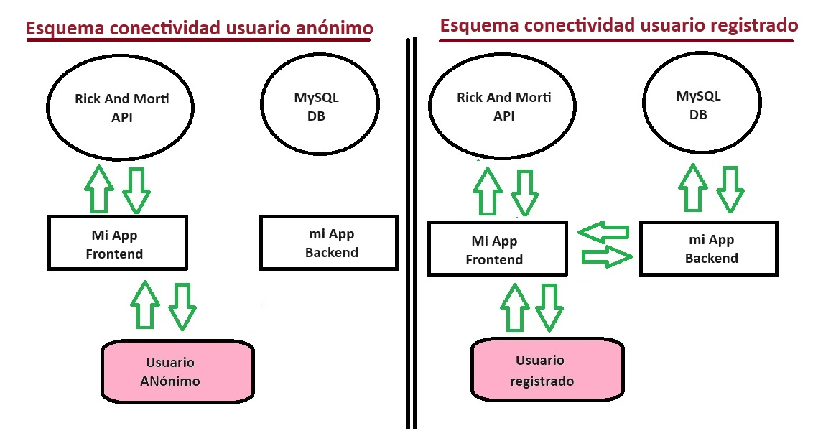
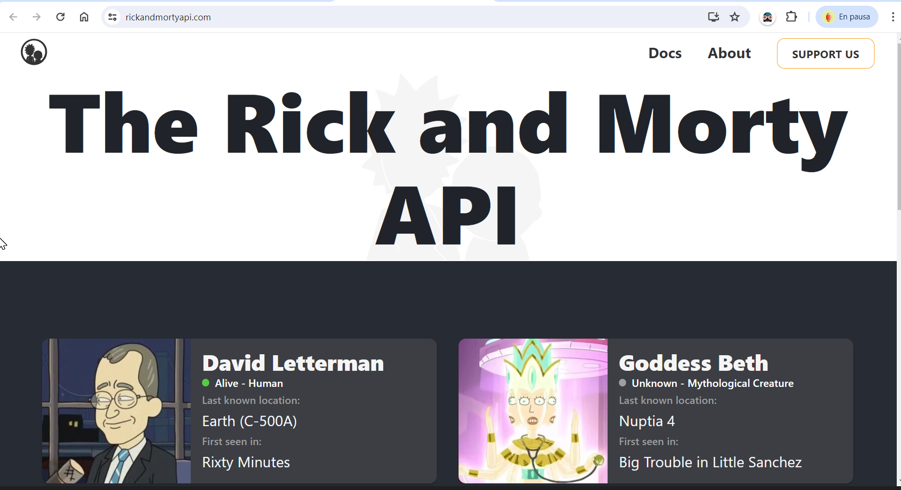
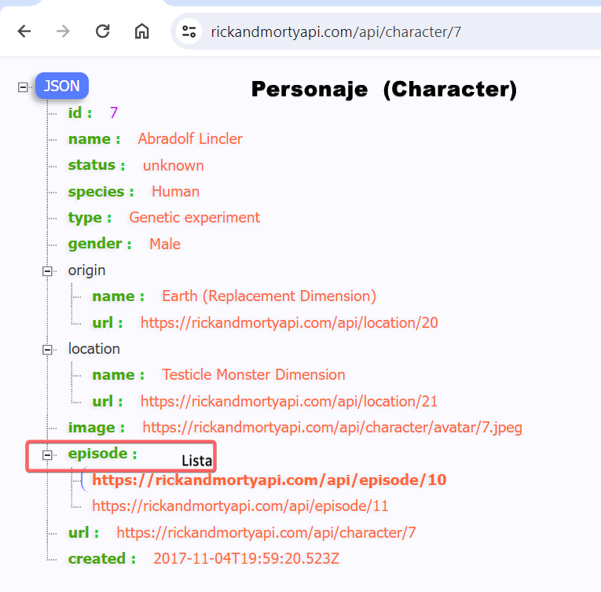
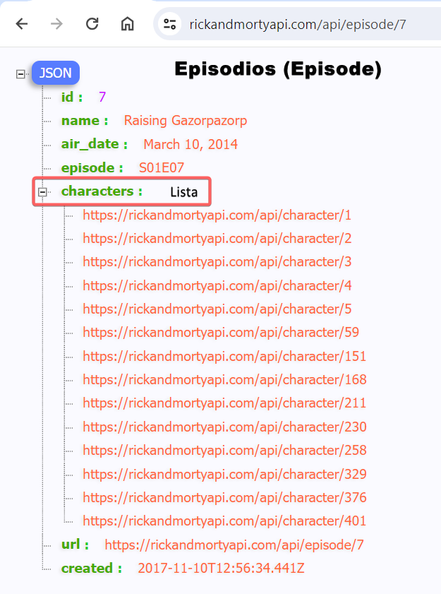
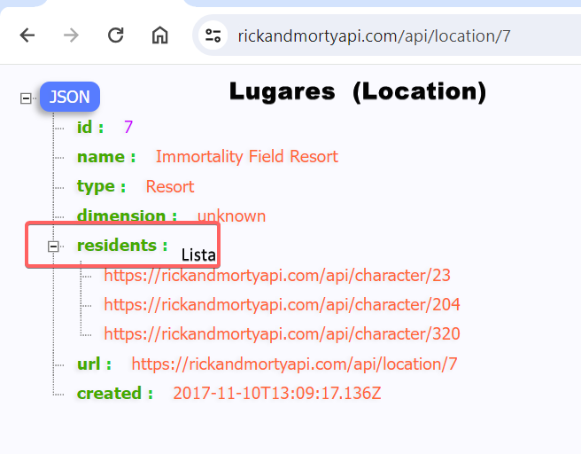
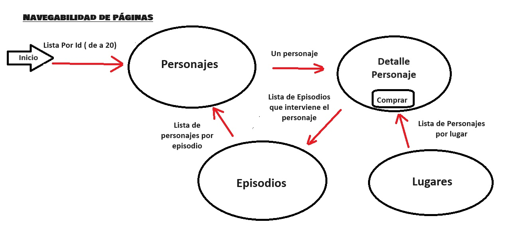
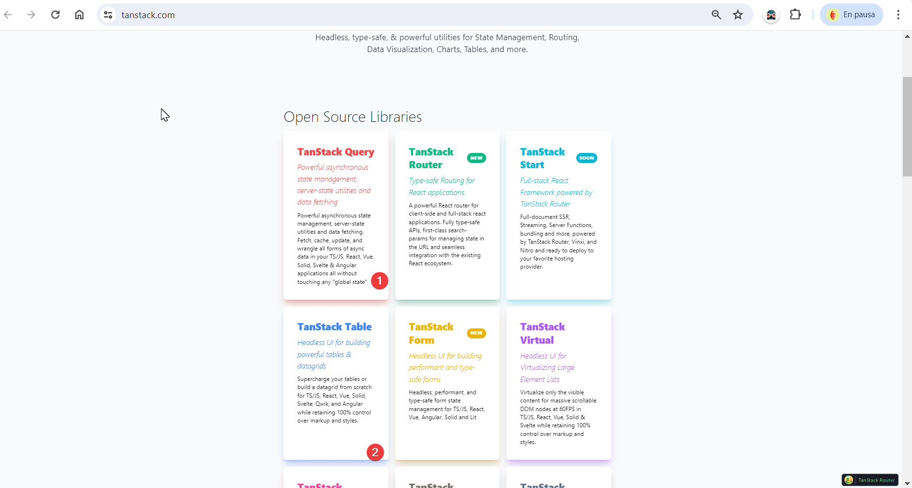

# Proyecto final UTNBA FULSTACK MERN
### Idea del proyecto

La idea radica en venta de posters, se supone una empresa que imprime y envia poster de personajes de ficción 
Entonces, utilizando una api existente se crea una capa de aplicación, donde se solicita un registro y se le otorga una lista de precios, (suponiendo que cada lista representa un costo adicional por gastos de envío  por ejemplo o identificar a cliente por compra mayorista)

Un usuario Anónimo solo podrá navegar por la página obteniendo la misma respuesta de la aplicación existente de terceros ( RickAndMorty). Luego Un usuario registado podrá almacenar lista de pedidos, como envío de mensajes al servidor, y compras

## Desafío encontrados

Por la estructura de la página quise utilizar todos los datos de la misma referentes al acceso de cada personaje. Cada personaje, lista más personajes por episodios. Por otro lado, cada Lugar o Episodio, tiene su propia lista de personajes. Se pretende que el usuario realice una navegación fluida entre Lugares, Episodios y Personajes, con posibilidad de acceder a más personajes con mayor factibilidad de venta.

Por ejemplo si selecciono al primer personaje (Rick Sanchez) interviene en 51 episodios, y si entro en episodio 01-08 o 01-10, intervienen 57 y 60 personajes respectivamente, al hacer click en algún personaje, me muestra el detalle de ese personaje (donde puedo agregarlo al carrito) y seguir navegando entre personajes.

#### Página de terceros 

#### Esquema de los datos de la aplicación externa

#### Páginas navegables

### problema en el desarrollo
La lista de personajes por episodios es diferente a la Lista por id y no era aceptable realizar de una petición

Queriendo minimizar las peticiones al servidor y tener mayor velocidad de acceso. Entonces decidí que lo mejor realizar una petición cada lote de personajes y almacenarlos localmente para no tener que volver a solitarlos si se vuelve al mismo.

## Esquema de la aplicación  

La aplicación necesariamente utiliza a usuarios registrados. Un usuario anónimo solo podrá navegar entre los datos de la API original. 

Existen tres listas de precios una en rangos de 3mil a 4mil,de 4mil a 5mil y de 5mil a 6mil, (un usuario nuevo se le asigna la de rango mas alto)

cada usuario tiene una lista de precio asignada
Un usuario registrado, recupera su lista de precios puede enviar notificaciones al servidor, almacenar una lista de personajes (con sus cantidades), ver y manipular detalle de carrito y realizar compras. 

Al realizar el Login, el sistema le recupera la carta (o pedido) que había guardado, e informa al usuario de que se recuperó el pedido provisorio, si no tiene guardado, notifica que no tenía lista provisoria guardada.

luego puede seguir modificando su pedido( agregar, eliminar o borrar) localmente, almacenarlo provisoriamente para recuperarlo luego, realizar la compra o enviar mensaje al servidor.

# Cronología de desarrollo

Tuve muchas idas y vueltas para que funcionara la página, al final decidí que debía que rehacer el proyecto ya que no cumplia con una aceptación mínima de funcionamiento.

Hice muchos pruebas, hasta que encontre la solución con la llamada incialmente REACT QUERY (https://tanstack.com/)

Utilizo dos soluciones de Tanstack:
1. Tanstack Query
2. Tanstack Table

    Con la primera realizo una petición al servidor de los primeros 20 elementos de la página y los almaceno en un caché por número de paginación, entonces la nevegación es muy rápida y si se vuelve a solicitar la misma página no la solicta, la muestra directamente.

    Con la segunda realizo desde el menú MyCart las modificaciones de la  compra de cada usuario.

