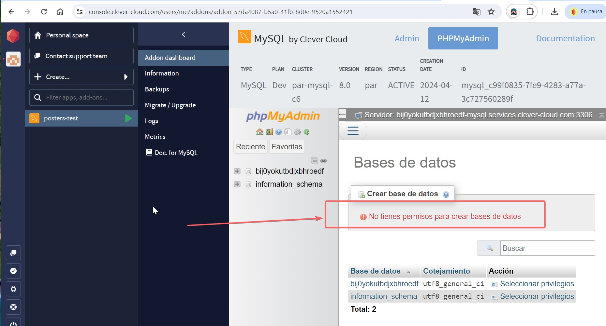

# Proyecto final UTNBA FULSTACK MERN
### Idea del proyecto

La idea radica en venta de posters, se supone una empresa que imprime y envia poster de personajes de ficción 
Entonces, utilizando una api existente se crea una capa de aplicación, donde se solicita un registro y se le otorga una lista de precios, (suponiendo que cada lista representa un costo adicional por gastos de envío  por ejemplo o identificar a cliente por compra mayorista)

Un usuario Anónimo solo podrá navegar por la página obteniendo la misma respuesta de la aplicación existente de RickAndMorty. Luego Un usuario registado podrá almacenar lsta de pedidos, como envío de mensajes al servidor, y compras

## Desafío encontrados

#### Otros personajes de episodios del personaje elegido
El problema o desafío encontrado, radica que el proyecto utilza una api externa. Quería reflejar el 100% de la información de la API y optimizar los tiempos de espera de la aplicación al solicitar datos permanentemente.

Cada  personaje (el producto de mi api), trae links a otros personajes (por medio Lista de Episodes) y quise mantener ese hilo de navegación entre personajes (para llegar siempre al detalle que es donde se hace la compra)

Por ejemplo si selecciono al primer personaje (Rick Sanchez) interviene en 51 episodios, y si entro en episodio 01-08 o 01-10, intervienen 57 y 60 personajes respectivamente, al hacer clcik en algún personaje, me muestra el detalle de ese personaje (donde puedo agregarlo al carrito) y seguir navegando entre personajes.

#### Paginación
Tambíen, no era aceptable estar haciendo una petición por cada personaje, location o episode para mostrar los datos de cada paginación.

En la navegación paginada de personajes, locations o episodios, Decidí que lo mejor realizar una petición cada 20 elementos almacenarlos localmente, es decir no volver a solicitarla si volvía a la misma página durante la navegación.

## Solución al CRUD requerido

La aplicación necesariamente utiliza a usuarios registrados. Un usuario anónimo solo podrá navegar entre los datos de la API original.
Un usuario registrado, puede enviar notificaciones al servidor, almacenar una lista de personajes con sus cantidades, y realizar compras. 

Un usuario registrado al entrar al sistema, el sistema le recupera la carta (o pedido) que había guardado, e informa al usuario de que se recuperó el pedido provisorio, si no tiene guardado, notifica que no tenía lista provisoria guardada.

luego puede seguir modificando su pedido( agregar, eliminar o borrar) localmente, almacenarlo provisoriamente para recuperarlo luego, realizar la compra o enviar mensaje al servidor.

## Problemas con Base datos

No pude mantener el alta de la base de datos en clever-cloud, si bien me dejo crearla
a los pocos dias, borro el contendio y me aparecio la siguiente imagen, donde no puedo dar mas de alta una base sin antes poner una tarjeta
Momentaneamente envío el codigo con archivo de exportacion de base de datos posters (mysql) para montarlo localmente (en posters-bakend)
voy a buscar una publicación alternativa de ser necesario

# Cronología

Tuve muchas idas y vueltas para que funcionara la página, al final decidí que debía que reahacer el proyecto ya que no cumplia con una aceptación mínima.

Hice muchos pruebas, hasta que encontre la solución con la llamada incialmente REACT QUERY (https://tanstack.com/)

Utilizo dos soluciones de Tanstack:
1. Tanstack Query
2. Tanstack Table

    Con la primera realizo una petición al servidor de los primeros 20 elementos de la página y los almaceno en un caché por número de paginación, entonces la nevegación es muy rápida y si se vuelve a solicitar la misma página no la solicta, la muestra directamente.

    Con la segunda realizo desde el menú MyCart las modificaciones de la  compra de cada usuario.

## Video de muestra

Como no pude subir la aplicacion realicé un video de muestra de funcionamiento

